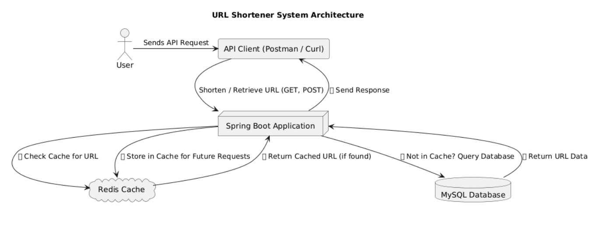

# ClipLinker - URL Shortener Service

## Overview
This project is a URL shortener service that generates shortened URLs for long URLs and provides analytics such as click count and expiry times. The application uses **Spring Boot, MySQL, and Redis** for fast lookups and caching.

## Features
- **Shorten URLs**: Generate a unique short URL from a long URL.
- **Custom Alias Support**: Users can provide a custom alias.
- **Expiry Time**: URLs can have an expiration time.
- **Redirect to Original URL**: Shortened URLs will redirect to the original URL.
- **Analytics**: Retrieve click count, expiry time, and other metadata.
- **Redis Cache**: Speeds up retrieval by caching short URLs.



## Technologies Used
- **Spring Boot**
- **Spring Data JPA** (for MySQL database operations)
- **Redis** (for caching URLs)
- **MySQL** (for persistent storage)
- **Docker** (optional for containerized deployment)

## Setup Instructions

### Prerequisites
- Java 17+
- Maven
- MySQL database
- Redis server

### Clone the Repository
```bash
git clone https://github.com/Hariharan1893/ClipLinker-API.git
cd ClipLinker-API
```

### Configure MySQL and Redis
1. Update `application.properties` with your MySQL and Redis credentials:
```properties
spring.datasource.url=jdbc:mysql://localhost:3306/url_shortener
spring.datasource.username=root
spring.datasource.password=yourpassword

spring.redis.host=localhost
spring.redis.port=6379
```

2. Run MySQL and create the database:
```sql
CREATE DATABASE url_shortener;
```

3. Start Redis server:
```bash
redis-server
```

### Build and Run
```bash
mvn clean install
mvn spring-boot:run
```

## API Endpoints

### 1. Shorten a URL
**Endpoint:**
```http
POST /shorten
```
**Request Body:**
```json
{
    "originalUrl": "https://example.com",
    "customAlias": "myalias",
    "expiryTime": "2025-12-31T23:59:59"
}
```
**Response:**
```json
{
    "shortUrl": "http://localhost:8080/myalias"
}
```
**Errors:**
- `400 BAD REQUEST` if alias is already taken.

---

### 2. Get Original URL (Redirect)
**Endpoint:**
```http
GET /{shortUrl}
```
**Response (Redirects to original URL)**
- If found, **302 Redirect** to the original URL.
- If expired, **400 BAD REQUEST**.
- If not found, **404 NOT FOUND**.

---

### 3. Get URL Analytics
**Endpoint:**
```http
GET /analytics/{shortUrl}
```
**Response:**
```json
{
    "shortUrl": "myalias",
    "originalUrl": "https://example.com",
    "clickCount": 5,
    "expiryTime": "2025-12-31T23:59:59"
}
```
**Errors:**
- `400 BAD REQUEST` if the URL is expired.
- `404 NOT FOUND` if the URL does not exist.

---

### 4. Delete a Shortened URL
**Endpoint:**
```http
DELETE /delete/{shortUrl}
```
**Response:**
```json
{
    "message": "URL deleted successfully"
}
```
**Errors:**
- `400 BAD REQUEST` if URL has dependencies (foreign key constraints).
- `404 NOT FOUND` if the URL does not exist.

---

## Notes
- URLs are **cached in Redis** for fast lookups.
- Expired URLs cannot be accessed.
- Analytics includes **click counts**.

## License
This project is open-source under the MIT License.

